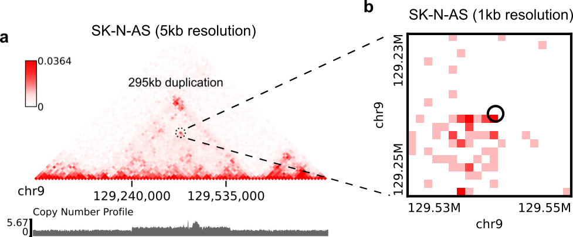

EagleC
******
Hi-C, a technique that was originally invented to study three-dimensional genome
structure, has been shown to be a promising method to detect structural variations
(SVs) in cancer and other human diseases. However, algorithms that can take such
advantage of Hi-C data for full-range SV detection have been severely lacking.
Current state-of-the-art software can only identify inter-chromosomal translocations
and long-range intra-chromosomal SVs (>1Mb). Therefore, we develop EagleC, a
computational framework that combines deep-learning and ensemble-learning strategies
to predict a full range of SVs at high-resolution, including many short-range SVs
that were missed or mis-labeled as chromatin loops in previous approaches. More
importantly, we demonstrate that EagleC also effectively captures SVs in other major
chromatin interaction platforms, such as HiChIP, ChIA-PET, and capture Hi-C. We apply
EagleC in over 100 cancer cell lines and primary tumors, and identify a valuable set
of high-quality SVs that are related with key cancer gene regulation through the
disruption of 3D genome organization. Finally, we extend the framework to single-cell
Hi-C and demonstrate its potential in studying SV heterogeneity in primary tumors.

Unique features of EagleC
=========================
- EagleC is able to accurately detect a full range of SVs including short-range SVs with
  breakpoint distance less than 100kb or even 50kb
- EagleC is designed to accept any 3C-based contact maps, including Hi-C, Micro-C, HiChIP,
  ChIA-PET, capture Hi-C, and single-cell Hi-C
- EagleC can be used to predict SVs in any species (it has been tested in human, mouse, and
  zebrafish)

Citation
========
Wang, X., Luan, Y., Yue, F. EagleC: A deep-learning framework for detecting a full range of
structural variations from bulk and single-cell contact maps. Sci Adv. 2022.

Navigation
==========
- `Installation`_
- `Download pre-trained models`_
- `Overview of the commands`_
- `Quick Start`_
- `Annotate gene fusions`_
- `Visualize predicted SVs on contact maps`_
- `Locate high-resolution coordinates given a list of low-resolution SVs`_
- `Predict SVs at higher resolutions`_
- `Predict SVs in other species`_

Installation
============
First, install following python packages through `conda <https://conda.io/miniconda.html>`_::

    $ conda config --add channels defaults
    $ conda config --add channels bioconda
    $ conda config --add channels conda-forge
    $ conda create -n EagleC python=3.8.12 cooler=0.8.6 joblib=1.0.1 scikit-learn=0.24.1 statsmodels=0.12.2 tensorflow=2.3.0 cython=0.29.24 matplotlib pyBigWig pyensembl

.. note:: *matplotlib* and *pyBigWig* are only required if you want to use the visualization module
   to view the predicted SVs on contact maps, and *pyensembl* is only required if you want to annotate
   potential gene fusions given a list of SV breakpoints.

If you are installing EagleC in Linux, just execute the command below to install
EagleC from `PyPI <https://pypi.org/project/eaglec/>`_::

    $ pip install eaglec

If you are installing EagleC in MacOS, please download and install an appropriate package
from `here <https://github.com/XiaoTaoWang/EagleC/releases>`_::

    $ pip install eaglec-0.1.2-cp38-cp38-macosx_10_9_x86_64.whl

Download pre-trained models
===========================
We have trained a series of EagleC models covering various sequencing depths
for both bulk Hi-C maps and single-cell Hi-C maps. Before running EagleC,
we recommend downloading these pre-trained models by simply executing the
command below. In prediction, EagleC will automatically select the most
appropriate models according to the number of contacts in your contact map::

    $ download-pretrained-models

Overview of the commands
========================
EagleC is distributed with 6 command-line tools. Type ``command [-h]`` in a terminal
window to learn the basic usage of each command.

- predictSV

  *predictSV* is the main command we used to predict SVs from bulk Hi-C/HiChIP/ChIA-PET
  contact maps in this work. It is based on *predictSV-single-resolution* and automatically
  combines predictions from 5kb, 10kb, and 50kb resolutions. For 10kb and 50kb predictions,
  it further searches for the most probable breakpoint coordinates within a local region on
  5kb contact maps so that all the reported SVs are at the 5kb resolution. 

  The inputs to this command are three genome-wide contact maps at 5kb, 10kb, and 50kb
  resolutions in .cool format (cool URIs, refer to `cooler <https://github.com/open2c/cooler>`_
  if you are not familiar with this format). If you only have `.hic files <https://github.com/aidenlab/juicer>`_,
  consider converting your files to the ".cool" format using `hic2cool <https://github.com/4dn-dcic/hic2cool>`_
  or `pairLiftOver <https://github.com/XiaoTaoWang/pairLiftOver#usage>`_. The predicted SVs can
  be selected to be reported in two formats: 1) "--output-format full" will report 8 columns
  for each SV, including breakpoint coordinates (chrom1, pos1, chrom2, pos2) and probability
  values of each fusion type (++, +-, -+, and --) (refer to Figures S1-S2 for the definition
  of each fusion type); 2) "--output-format NeoLoopFinder" will output a file (6 columns) that
  can be directly used as the `NeoLoopFinder <https://github.com/XiaoTaoWang/NeoLoopFinder>`_ input.

- predictSV-single-resolution

  This command predicts SVs at single resolution. By default, it searches for SVs throughout the
  whole genome; however, it can also perform a local search on high-resolution matrices if SVs
  at lower resolutions are provided through the parameter "--low-resolution-breaks".

- merge-redundant-SVs

  This command merges multiple SV calls from the same sample. The inputs are one or multiple SV files
  from *predictSV* or *predictSV-single-resolution* in "full" format (8 columns). Again, the output
  format has two options ("full" and "NeoLoopFinder").

- annotate-gene-fusion

  This command can be used to annotate gene fusion events for a list of SV breakpoints. The input to
  this command is an SV file with breakpoint coordinate information (chrom1, pos1, chrom2, pos2)
  in the first four columns and a release number of ensembl genes.

- plot-interSVs

  This command can be used to plot a chromosome-wide contact map with predicted SVs marked on it.

- plot-intraSVs

  This command can be used to plot a local intra-chromosomal contact map with predicted SVs marked on it.

Quick Start
===========
First, let's download a processed Hi-C dataset (~163M contact pairs) in SK-N-AS
(a neuroblastoma cell line)::

    $ wget -O SKNAS-MboI-allReps-filtered.mcool -L https://www.dropbox.com/s/f80bgn11d7wfgq8/SKNAS-MboI-allReps-filtered.mcool?dl=0

The downloaded ".mcool" file contains contact matrices at multiple resolutions. To list all
individual cool URIs within it, execute the ``cooler ls`` command below::

    $ cooler ls SKNAS-MboI-allReps-filtered.mcool

    SKNAS-MboI-allReps-filtered.mcool::/resolutions/5000
    SKNAS-MboI-allReps-filtered.mcool::/resolutions/10000
    SKNAS-MboI-allReps-filtered.mcool::/resolutions/25000
    SKNAS-MboI-allReps-filtered.mcool::/resolutions/50000
    SKNAS-MboI-allReps-filtered.mcool::/resolutions/100000
    SKNAS-MboI-allReps-filtered.mcool::/resolutions/250000
    SKNAS-MboI-allReps-filtered.mcool::/resolutions/500000
    SKNAS-MboI-allReps-filtered.mcool::/resolutions/1000000
    SKNAS-MboI-allReps-filtered.mcool::/resolutions/2500000
    SKNAS-MboI-allReps-filtered.mcool::/resolutions/5000000

Next, let's use the *predictSV* command to predict SVs on this dataset::

    $ predictSV --hic-5k SKNAS-MboI-allReps-filtered.mcool::/resolutions/5000 \
                --hic-10k SKNAS-MboI-allReps-filtered.mcool::/resolutions/10000 \
                --hic-50k SKNAS-MboI-allReps-filtered.mcool::/resolutions/50000 \
                -O SK-N-AS -g hg38 --balance-type CNV --output-format full \
                --prob-cutoff-5k 0.8 --prob-cutoff-10k 0.8 --prob-cutoff-50k 0.99999

As we mentioned in `Overview of the commands`_, contact matrices at three resolutions
5kb, 10kb, and 50kb will be used. Here are some suggestions for individual parameters:

1) ``--balance-type``, here by specifying "--balance-type CNV", *predictSV* will perform
   predictions on CNV-normalized matrices. You can also select to use ICE-normalized matrices
   by specifying "--balance-type ICE" or Raw matrices by specifying "--balance-type Raw".
   According to our test, for the same sample, running on the Raw matrix tends to detect
   more SVs with lower accuracy, while running on the CNV/ICE normalized matrices usually
   achieves higher accuracy but detects fewer SVs.

.. note:: If you choose CNV, make sure you have run "correct-cnv" of the
   `NeoLoopFinder <https://github.com/XiaoTaoWang/NeoLoopFinder>`_
   toolkit before you run this command; if you choose ICE, make sure you have run
   "cooler balance" on your Hi-C matrices before you run this command.

2) By default, we apply probability cutoffs of 0.8, 0.8, and 0.99999 at 5kb, 10kb, and 50kb
   resolutions, respectively. We found this set of cutoffs achieved a good tradeoff between
   sensitivity and specificity in most of our tests. If you care more about sensitivity,
   just tune down these cutoffs.

Running *predictSV* on a single CPU core is expected to be slow, as it iterates submatrices of all
candidate pixels on these contact matrices. To speed up the calculation, *predictSV* supports
parallel computation for different intra-chromosomal and inter-chromosomal matrices, by creating
hidden lock files to avoid conflicts between jobs. This strategy is especially efficient when
you are performing the calculation in a computational cluster. Depending on your cluster environment,
you need to create a job submission script. Here is an example slurm script named as "slurm-predictSV.sh"::

    #!/bin/bash
    #SBATCH -A b1042
    #SBATCH -p genomicsguestA
    #SBATCH -t 48:00:00
    #SBATCH -N 1
    #SBATCH --mem=16G
    #SBATCH --cpus-per-task=1

    #SBATCH --job-name=predictSV
    #SBATCH --output=predictSV.%j.%N.txt
    #SBATCH --error=predictSV.%j.%N.err

    source /home/xwl2576/.bashrc
    conda activate EagleC

    predictSV --hic-5k SKNAS-MboI-allReps-filtered.mcool::/resolutions/5000 \
              --hic-10k SKNAS-MboI-allReps-filtered.mcool::/resolutions/10000 \
              --hic-50k SKNAS-MboI-allReps-filtered.mcool::/resolutions/50000 \
              -O SK-N-AS -g hg38 --balance-type CNV --output-format full \
              --prob-cutoff-5k 0.8 --prob-cutoff-10k 0.8 --prob-cutoff-50k 0.99999

Then all you need to do is to submit this script for a certain number of times::

    $ for i in {1..16}; do sbatch slurm-predictSV.sh; sleep 40s; done

The above command will launch 16 parallelized jobs and should be able to finish within 2 hours.

.. note:: EagleC will cache all the intermediate results within hidden folders in
   your current working directory. In this example, these folders will be prefixed with
   ".SKNAS-MboI-allReps-filtered.mcool". If you want to start a fresh job without using
   previous cached results, or if your previous jobs were killed or terminated
   by the system, you may need to first remove those intermediate files by executing
   ``rm -rf .SKNAS-MboI-allReps-filtered.mcool*``.

If no errors occurred, 6 files ("SK-N-AS.CNN_SVs.10K_highres.txt", "SK-N-AS.CNN_SVs.10K.txt",
"SK-N-AS.CNN_SVs.50K_highres.txt", "SK-N-AS.CNN_SVs.50K.txt", "SK-N-AS.CNN_SVs.5K_combined.txt",
and "SK-N-AS.CNN_SVs.5K.txt") will be outputed in current working directory. Among them,
the file "SK-N-AS.CNN_SVs.5K_combined.txt" contains the final non-redundant SVs combined from 5kb,
10kb, and 50kb resolutions::

    $ head SK-N-AS.CNN_SVs.5K_combined.txt

    chrom1	pos1	chrom2	pos2	++	+-	-+	--
    chr10	100540000	chr10	101175000	1.885e-15	4.558e-22	1	1.827e-16
    chr11	100080000	chr11	100160000	1.319e-26	1	1.47e-23	1.292e-15
    chr11	40120000	chr11	40300000	2.869e-13	7.797e-17	0.964	1.603e-17
    chr11	71720000	chr17	32285000	3.397e-23	1	8.086e-15	1.674e-18
    chr12	111605000	chr16	83395000	6.232e-29	1.972e-28	1	8.747e-27
    chr13	63030000	chr17	22155000	1.812e-10	1.975e-16	0.9197	2.687e-12
    chr16	21580000	chr16	22695000	1	4.339e-28	6.561e-27	1.242e-17
    chr17	73790000	chr19	780000	1.392e-21	2.4e-29	2.071e-24	1
    chr18	47755000	chr18	48025000	1.861e-13	3.204e-14	0.9863	1.928e-16

Annotate gene fusions
=====================
To annotate potential gene fusion events from the predicted SVs above, just execute
the command below::

    $ annotate-gene-fusion --sv-file SK-N-AS.CNN_SVs.5K_combined.txt \
                           --output-file SK-N-AS.gene-fusions.txt \
                           --buff-size 10000 --skip-rows 1 --ensembl-release 93 --species human

Here by specifying "--ensembl-release 93 --species human", *annotate-gene-fusion* uses
the Ensembl gene release 93 of the human genome as a database to search for genes at any
genomic loci. The "--buff-size" parameter determines the genomic span (in base pair)
of the breakpoints for each SV. Here, a gene will be considered at a breakpoint if its
interval is overlapped with the +/-10kb region centered at the breakpoint::

    $ head -5 SK-N-AS.gene-fusions.txt

    chr12	111605000	chr16	83395000	6.232e-29	1.972e-28	1	8.747e-27	ATXN2-CDH13
    chr1	1930000	chr1	10975000	2.572e-25	1	1.017e-17	1.627e-20	CFAP74-C1orf127
    chr1	25255000	chr1	25330000	8.584e-19	0.8123	1.172e-19	4.559e-14	RSRP1-TMEM50A,RSRP1-RHD
    chr1	1765000	chr1	1905000	2.688e-11	1.744e-18	0.8671	6.763e-09	NADK-CALML6
    chr3	60625000	chr17	42830000	6.303e-24	8.763e-27	7.642e-27	1	FHIT-BECN1,FHIT-PSME3

Visualize predicted SVs on contact maps
=======================================
Here are example commands to visualize SVs on chromosome-wide contact maps::

    $ plot-interSVs --cool-uri SKNAS-MboI-allReps-filtered.mcool::resolutions/1000000 \
                    --full-sv-file SK-N-AS.CNN_SVs.5K_combined.txt --output-figure-name chr4-chr8.png \
                    -C chr4 chr8 --balance-type Raw --dpi 800 # panel A
    $ plot-interSVs --cool-uri SKNAS-MboI-allReps-filtered.mcool::resolutions/1000000 \
                    --full-sv-file SK-N-AS.CNN_SVs.5K_combined.txt --output-figure-name chr7-chr22.png \
                    -C chr7 chr22 --balance-type Raw --dpi 800 # panel B

Here are example commands to visualize SVs on local intra-chromosomal contact maps::

    $ wget -O SKNAS_merged.dedup.bam_ratio.bw -L https://www.dropbox.com/s/usjjc6neqs5fk3a/SKNAS_merged.dedup.bam_ratio.bw?dl=0
    $ plot-intraSVs --cool-uri SKNAS-MboI-allReps-filtered.mcool::resolutions/10000 \
                    --full-sv-file SK-N-AS.CNN_SVs.5K_combined.txt \
                    --cnv-file SKNAS_merged.dedup.bam_ratio.bw \
                    --region chr9:128940000-129835000 --output-figure-name intraSV-example1.png \
                    --coordinates-to-display 129240000 129535000 \ 
                    --balance-type CNV --dpi 800 # panel A
    $ plot-intraSVs --cool-uri SKNAS-MboI-allReps-filtered.mcool::resolutions/5000 \
                    --full-sv-file SK-N-AS.CNN_SVs.5K_combined.txt \
                    --cnv-file SKNAS_merged.dedup.bam_ratio.bw \
                    --region chr5:98735000-98970000 --output-figure-name intraSV-example2.png \
                    --coordinates-to-display 98815000 98890000 \
                    --contact-max-value 0.04 \
                    --balance-type CNV --dpi 800 # panel B

In above figures, the predicted SVs are marked by black dashed circles.

Locate high-resolution coordinates given a list of low-resolution SVs
=====================================================================
Suppose you have a high-resolution contact map at the 1kb or 2kb resolution, and a list of
SVs detected from relatively low-resolution (50kb/10kb) contact maps of the same sample,
you want to use the high-resolution map to find more precise breakpoint coordinates for
these SVs, rather than perform a genome-wide SV prediction on the high-resolution map.
With the *predictSV-single-resolution* command, you can easily get this job done by specifying
the "--low-resolution-breaks" parameter.

For example, the coordinate of the duplication showed in the previous figure (panel A) were
determined as ("chr9", 129,240,000, "chr9", 129,535,000) at the 5kb resolution. Now let's try
to use the *predictSV-single-resolution* command to find more precise coordinates at the 1kb resolution.

First, let's extract the line containing this duplication from "SK-N-AS.CNN_SVs.5K_combined.txt"
and put it into a new TXT file::

    $ head -1 SK-N-AS.CNN_SVs.5K_combined.txt > test.txt
    $ grep '129240000\|129535000' SK-N-AS.CNN_SVs.5K_combined.txt >> test.txt
    $ cat test.txt

    chrom1	pos1	chrom2	pos2	++	+-	-+	--
    chr9	129240000	chr9	129535000	1.35e-13	5.094e-14	0.8477	6.37e-18

Then download the SK-N-AS Hi-C map at the 1kb resolution::

    $ wget -O SKNAS-MboI-allReps-filtered.1kb.cool -L https://www.dropbox.com/s/m8tqsr7ics9juas/SKNAS-MboI-allReps-filtered.1kb.cool?dl=0

And execute the command below::

    $ predictSV-single-resolution -H SKNAS-MboI-allReps-filtered.1kb.cool -O test.1k.txt \
                                  -g hg38 --balance-type Raw --low-resolution-breaks test.txt \
                                  --region-size 10000

Here by specifying ``--region-size 10000``, we limit the program to perform a local search within
+/-10kb of the input coordinates. Wait ~1 minutes, then you can find more precise breakpoint
coordinates in "test.1k.txt"::

    $ cat test.1k.txt

    chrom1	pos1	chrom2	pos2	++	+-	-+	--
    chr9	129239000	chr9	129536000	1.35e-13	5.094e-14	0.8477	6.37e-18

Note that when you run *predictSV-single-resolution* with the parameter "--low-resolution-breaks",
the program will keep the probability scores the same and only change the coordinates in the 2nd
and 4th columns.

Predict SVs at higher resolutions
=================================
If you want to predict smaller SVs, try "predictSV-single-resolution" on high-resolution
maps (1kb or 2kb) without specifying the "--low-resolution-breaks" parameter.

In this example, we will use a CTCF ChIA-PET dataset (containing ~266M usable reads) to
predict SVs in MCF7 at the 2kb resolution::

    $ wget -O ChIA-PET_hg38_MCF7_CTCF_pairs.2K.cool -L https://www.dropbox.com/s/bqz71zn9pg5si6a/ChIA-PET_hg38_MCF7_CTCF_pairs.2K.cool?dl=0

Again, let's create a job submission script "slurm-predictSV-2k.sh"::

    #!/bin/bash
    #SBATCH -A b1042
    #SBATCH -p genomicsguestA
    #SBATCH -t 48:00:00
    #SBATCH -N 1
    #SBATCH --mem=20G
    #SBATCH --cpus-per-task=1

    #SBATCH --job-name=eaglec
    #SBATCH --output=eaglec.%j.%N.txt
    #SBATCH --error=eaglec.%j.%N.err

    source /home/xwl2576/.bashrc
    conda activate EagleC

    predictSV-single-resolution --hic ChIA-PET_hg38_MCF7_CTCF_pairs.2K.cool \
                                -O MCF7_CTCF-ICE.SVs.2k.txt -g hg38 \
                                -C 1 18 --maximum-size 100000 --balance-type ICE \
                                --add-log-header --logFile eaglec-ice-2k.log

And submit it for a number of times::

    for i in {1..2}; do sbatch slurm-predictSV-2k.sh; sleep 40s; done

Note that identifying SVs on 1kb/2kb contact maps is really time consuming. Here by specifying
``-C 1 18 --maximum-size 100000``, we limit our search space to chromosomes 1 and 18, and only
consider SV candidates with breakpoint distance less than 100kb.

This job will finish within 10 minutes. Now let's plot the predicted SVs::

    $ cat MCF7_CTCF-ICE.SVs.2k.txt

    chr18	3212000	chr18	3278000	8.129e-18	7.563e-19	0.9997	2.274e-16
    chr1	152584000	chr1	152616000	1.324e-09	0.9528	6.386e-10	6.64e-08

    $ wget -O MCF7_merged.dedup.bam_ratio.bw -L https://www.dropbox.com/s/rstx3lzvpin8d0m/MCF7_merged.dedup.bam_ratio.bw?dl=0
    $ plot-intraSVs --cool-uri ChIA-PET_hg38_MCF7_CTCF_pairs.2K.cool \
                    --full-sv-file MCF7_CTCF-ICE.SVs.2k.txt \
                    --cnv-file MCF7_merged.dedup.bam_ratio.bw \
                    --region chr1:152547000-152649000 --output-figure-name intraSV-example3.png \
                    --coordinates-to-display 152582000 152614000 \
                    --balance-type ICE --dpi 800 # panel A
    $ plot-intraSVs --cool-uri ChIA-PET_hg38_MCF7_CTCF_pairs.2K.cool \
                    --full-sv-file MCF7_CTCF-ICE.SVs.2k.txt \
                    --cnv-file MCF7_merged.dedup.bam_ratio.bw \
                    --region chr18:3142000-3348000 --output-figure-name intraSV-example4.png \
                    --coordinates-to-display 3212000 3278000 \
                    --balance-type ICE --dpi 800 # panel B

Predict SVs in other species
============================
To predict SVs in other species, just specify "--genome other" when you run
*predictSV* or *predictSV-single-resolution*.
